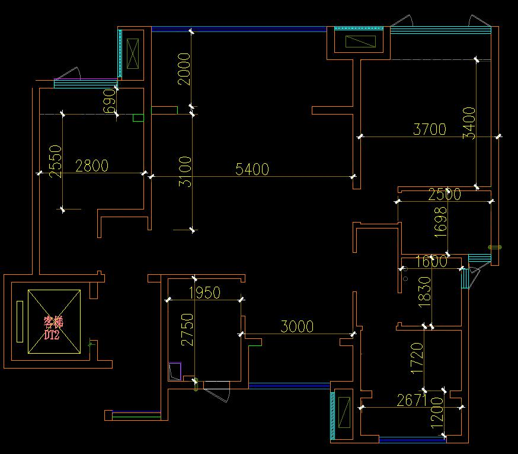

+++
title = '七月的风'
date = '2026-07-16T22:20:36+08:00'
showToc = true
draft = false
+++

七月，就过去一半了。这半个月气温逐渐升高，从连绵不断的雨，到迎面燥热的风。10号台风巴威虚谎一枪，与江西擦肩而过，并没有带来预想中强雨和强风，就过去了。  

上个月28号结束了长达一年的漫长看房生涯，正式买房了，交了5万的房子定金和1万的车位定金，这个月1号就交了房子的首付，银行卡的余额瞬间清空了。上一次银行卡账户大幅支出，还是2023年取钱结婚的时候，这次交房屋的首付，我和振丽开玩笑说，今天又结了一次婚。

1号上午办了贷款的手续，又去银行开户。回到家后，接下来几天就在琢磨装修，只不过这种状态只维持了几天，随着时间的推移，后面就没怎么琢磨了。

这个月上班的感受就是好累，给陈璐上了个班，给肖信上了个班，这个月没怎么休息好，少休息两天竟然这么累，每天都是睡眠不足的状态。

崽崽这个月就4个月了，这个月抬头越来越棒，特别爱笑。

<video controls width="100%" style="border-radius: 8px; margin: 1rem 0;">
  <source src="kid-playing.mp4" type="video/mp4">
  您的浏览器不支持视频播放，请升级到最新版本。
</video>

这个月3T MR 工程师来培训了，正好给肖信上班的那天是3T MR，第二天又是自己的班，这两天还是学了不少东西的。